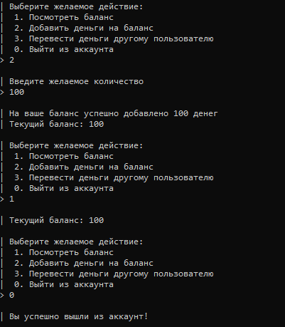

# simpleBank
#### My very simple bank system

## Run
1. Run the code

2. In the folder "resources" there is a config (config.json),
   where you can change the initial 6 digits of the card (default: 400000)
   and the name of the database file (by default: banking_system.sqlite).
   The sqlite database file will be created in the same folder

3. To check the number for compliance with the Luhn algorithm,
   you can use the site: https://simplycalc.com/luhn-validate.php

## UML
